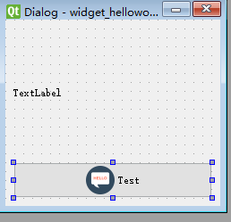
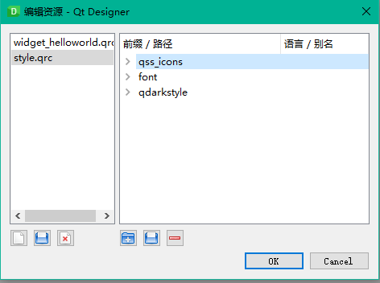
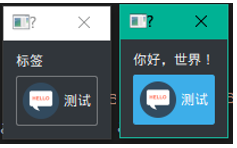

- 查找 Qt 库<br>
  创建一个文件夹，命名为 s1-CreateADialog 。同样需要创建一个CMakeLists.txt件、一个main.cpp文件以及一个 build.bat 文件。其中build文件与前例相同。由于示例中需要Qt的相关库，因此在上一个示例的CMakeLists基础之上，需要增加如下内容：
  ```cmake
  set(CMAKE_MODULE_PATH "${CMAKE_MODULE_PATH};${CMAKE_CURRENT_LIST_DIR}cmake")
  set(CMAKE_AUTOMOC ON)
  set(CMAKE_AUTORCC ON)
  set(CMAKE_AUTOUIC ON) #用于编译资源信息
  find_package(Qt5 COMPONENTS Core Gui Widgets LinguistTools REQUIRED)
  #find_package 获取QT5中的Core、Gui等组件
  
  
  ```
  这样，进行后续编译时即可查找到所需的 Qt 库。
- 创建 UI 文件<br>
  创建UI需要使用 Qt 自带的 Designer 工具进行实现。打开该工具并创建一个 Dialogwithout Button 类型的窗口。
  <br>
  将 QDialog 类命名为 WidgetHelloWorld ，添加一个 QPushButton 类命名为btn_test ，添加一个 QLabel 类命名为 lab_text。进行简单排版后界面如下。最终现的效果为：点击按钮，lab_text 输出Hello World。<br>
  <br>
  将创建好的 UI 文件命名为 widget_helloworld.ui ，并将其保存在s1-CreateADialog 文件夹下。至此，创建UI完成。
- 编辑 UI 代码<br>
  对应于上一步中创建的UI，创建相应的头文件 [widget_helloworld.h(cmake-tutorial//s1-CreateADialog/widget_helloworld.h) 和源文件[widget_helloworld.cpp](widget_helloworld.cpp) 。两个文件内容只有简单的Qt语法，这里不再赘述。特别强两个点：在源文件中第一行为如下代码：
  ```c++
  #pragma once 
  ```
  这表示这个头文件在一个单独的编译中只被包含一次。<br>
  源文件的第二行为：
  ```c++
  #include "ui_widget_helloworld.h"
  ```
  注意，此处引用的文件此时还没有被创建，但是由于CMakeLists文件中有```se(CMAKE_AUTOUIC ON)``` ，它会将UI文件转化为```ui_widget_helloworld.h```并于``` widget_helloworld.h```
  中对对话框进行处理。<br>
  最后，需要在 CMakeLists.txt 的最后添加如下代码，将之前创建的各种文件进行打包添加。
  ```cmake
  file(GLOB SOURCES *.cpp *.h)
  file(GLOB SOURCES_QT *.ui *.qrc *.ts)
  
  #以上为各类不同的文件进行打包和整理，再通过下一步的add_executable将其全部添到main之中。
  add_executable(main ${SOURCES} ${SOURCES_QT} ${QM_FILES} ${TS_FILES})
  target_link_libraries(main Qt5::Core Qt5::Widgets Qt5::Gui)
  #将上文中查找到的Qt的组件进行连接
  ```
  至此，编辑UI代码完成。参考创建控制台程序中的流程，此时代码已经可以通过build.ba进行编译。
- 修改 main.cpp 文件
  打开上一步中生成的 build 文件夹，打开生成的 sln 文件，在 main.cpp 下修改代码主函数最终代码如下：
  ```c++
  int main(int argc, char **argv) {
  QApplication app(argc, argv);
  WidgetHelloWorld dialog;
  dialog.show();
  return app.exec();
  }
  
  ```
  
  编译通过，但是运行提示错误。此处是由于有一插件未自动拷贝所致。在所创建的anaconda 环境的 plugins 下找到 platforms 插件复制到s1-CreateADialog\build\RelWithDebInfo  路径下即可成功运行。运行结果如下，击按钮，即可输出 Hello World 。
<br>
- 创建翻译文件以及主题、字体等
  - 更改主题与字体：将主题对应的 darkstyle 文件夹和字体对应的 font 文件夹放入s1-CreateADialog 文件夹下，打开UI文件进行相关资源的添加。<br>
<br> 
  在 main.cpp 中添加一个[load_style 函数](gmain.cpp)  并调用。
  - 创建翻译文件：为增加界面友好性，需将UI中的英文替换为中文，此时就需要添加一翻译文件。注意：在进行这一步之前，请确认在 CMakeLists 中查找到了LinguistTools 模块。<br> 
  在 s1-CreateADialog 文件夹下添加一个cmake文件夹，将[Qt5LinguistToolsMacrosNoInclude.cmake](cmake-tutorial/s1-CreateADialogcmake/Qt5LinguistToolsMacrosNoInclude.cmake) 放入该文件夹下。再将widget_helloworld_zh_CN.ts 放在 s1-CreateADialog 文件夹下。同时，在CMakeLists文件中添加如下内容对该文件进行加载：
    ```cmake
    include(Qt5LinguistToolsMacrosNoInclude)
    file(GLOB TS_FILES "widget_helloworld_zh_CN.ts")
    file(GLOB TS_SRC_FILES
              "*.h"
              "*.cpp"
              "*.hpp"
              "*.ui"
              "*.qrc")
    qt5_create_translation_no_include(QM_FILES
                                      "${TS_SRC_FILES}"
                                      ${TS_FILES}
                                      OPTIONS
                                      -locations
                                      relative)
    
    add_custom_command(
    TARGET main POST_BUILD
    COMMAND ${CMAKE_COMMAND} -E make_directory
            "$<TARGET_FILE_DIR:main>/resources/"
    COMMAND ${CMAKE_COMMAND} -E copy ${QM_FILES}
            "$<TARGET_FILE_DIR:main>/resources/"
    COMMENT "Copying translation files to $<TARGET_FILE_DIR:main>resources/"
    )                                   
    ```
   
然后需要在 main.cpp 添加一个[load_translator函数](main.cpp) 并调用。然后运行 build.bat ,生成新的 sln 。 打开双击 ts 文件，出现如下界面，补充对应的中文翻译即可。
<br>
  生成并运行，运行结果如下：<br>
<br>  
  至此，创建对话框程序结束。